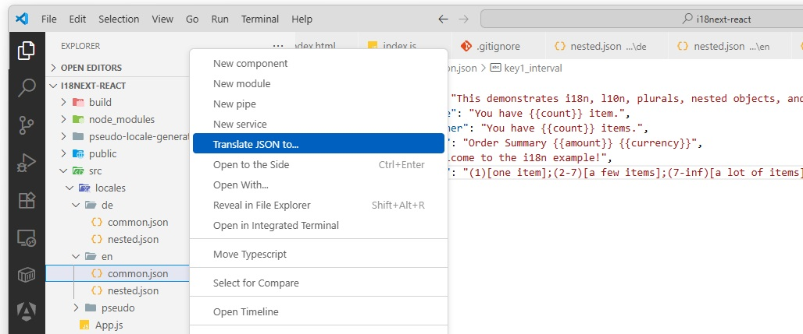

# Translate I18n JSON by l10n.dev

AI-powered localization in VS Code. Translate i18n JSON files directly in your editor using l10n.dev's intelligent translation service.



## Features

- 🤖 **AI-Powered Translation**: Context-aware translations using advanced AI.
- 🔧 **Customizable Translation Style**: Configure translations to use contractions (e.g., "don't" vs "do not"), enable shortening when translations exceed source text length, and generate plural forms for i18next compatibility.
- 🌐 **i18next Plural Forms Support**: Automatically generates all required plural form strings with correct plural suffixes when enabled—ideal for i18next projects. For languages with complex pluralization rules (like Russian, Arabic, or Polish), the extension ensures every necessary form is created, even if your source file only has `_one` or `_other`. This guarantees your app works correctly in every locale, with no missing or incorrect plural forms.
- 🛠️ **Developer-Friendly Features**: Preserves placeholders, HTML tags, and formatting while adapting dates and numbers to target locales. Intelligently avoids translating things that shouldn't be translated (proper names, urls, technical terms, etc.). Learn more in this article: [i18n vs l10n: Why Developers Should Care and How AI Can Help](https://medium.com/@AntonAntonov88/i18n-vs-l10n-why-developers-should-care-and-how-ai-can-help-fec7a7580d17).
- 🔐 **Secure API Key Storage**: Your API Keys are stored securely using VS Code's built-in secrets manager.
- 🎯 **Smart Language Detection**: Automatically detects target languages from your project structure for seamless file organization.
- 🌐 **i18next Support**: Works seamlessly with i18next and other common i18n formats.
- 🧩 **Source Text as Keys**: Supports projects using source text as translation keys.
- 🕵️ **Smart Error Detection & Chunking**: Automatically detects and retries translations if placeholders or formatting are lost by the AI. For large files, l10n.dev splits content into manageable chunks, maintaining links and context between segments. This prevents issues common with direct uploads to AI models (like Claude or GPT), where exceeding ~16,000 characters can cause the model to omit, merge, or shorten content—resulting in lost context and lower translation quality. l10n.dev's approach ensures high-quality, accurate translations even for large i18n files.
- 💰 **Free**: Users get 30,000 characters free monthly.

## Getting Started

### 1. Get Your API Key
1. Visit [l10n.dev/ws/keys](https://l10n.dev/ws/keys)
2. Sign up for a free account
3. Generate your API Key

### 2. Configure the Extension
1. Open VS Code Command Palette (`Ctrl+Shift+P` / `Cmd+Shift+P`)
2. Run `l10n.dev: Set API Key`
3. Paste your API Key when prompted

### 3. Translate Your Files
1. Right-click on any JSON file in the Explorer or Editor
2. Select `Translate JSON to...`
3. Choose your target language (detected automatically or search manually)
4. Wait for translation to complete
5. The translated file will be saved with the target language code

## Supported Project Structures

The extension automatically detects target languages from common i18n project structures and saves translated files accordingly:

### Folder-based Structure
```
locales/
├── en/
│   ├── common.json
│   └── auth.json
├── es/
├── fr/
└── de/
```

**How it works:**
- **Detection**: Language code is identified from the folder name (e.g., `en/`, `es/`, `fr/`)
- **File Saving**: Creates the target language folder if it doesn't exist and saves the file with the same name as the source file
- **Example**: Translating `locales/en/common.json` to Spanish → `locales/es/common.json`
- **Conflict Resolution**: If the target file already exists, adds a copy number (e.g., `common (1).json`)

### File-based Structure
```
i18n/
├── en.json
├── en-US.json
├── es.json
├── fr.json
├── de.json
└── zh-Hans-CN.json
```

**How it works:**
- **Detection**: Language code is identified from the filename (e.g., `en.json`, `es.json`, `fr.json`)
- **File Saving**: Saves the translated file using the target language code as the filename in the same folder
- **Example**: Translating `i18n/en.json` to Spanish → `i18n/es.json`
- **Conflict Resolution**: If the target file already exists, adds a copy number (e.g., `es (1).json`)

### Unknown Structure Fallback
For projects that don't match the above patterns, the extension falls back to saving files with the format: `{originalname}.{languagecode}.json` in the same directory as the source file.

## Configuration Options

Configure translation behavior in VS Code settings (`Ctrl+,` and search for "l10n-translate-i18n"):

- **Use Contractions**: Makes translations less formal (default: true)
- **Use Shortening**: Uses shortened forms if translation is longer than source (default: false)
- **Generate Plural Forms**: Generates additional plural form strings (e.g., for i18next) with plural suffixes. Do not enable for strict source-to-target mapping (default: false)

## Commands

- `Translate I18n: Set API Key` - Securely configure API Key
- `Translate I18n: Clear API Key` - Clear API Key in VS Code secrets storage
- `Translate I18n: Configure Translation Options` - Open extension settings
- `Translate I18n: Translate JSON to...` - Translate JSON file

## Language Support

l10n.dev supports 165+ languages with varying proficiency levels:
- **Strong (12 languages)**: English, Spanish, French, German, Chinese, Russian, etc.
- **High (53 languages)**: Most European and Asian languages
- **Moderate (100+ languages)**: Wide range of world languages

## Pricing

- **Free Characters**: 30,000 characters for free monthly.
- **Pay-as-you-go**: Affordable character-based pricing. Visit [l10n.dev/#pricing](https://l10n.dev/#pricing) for current pricing.
- **No subscription required**

## Troubleshooting

### Common Issues

**"API Key not configured"**
- Run `l10n.dev: Set API Key` command
- Ensure you've copied the key correctly from [l10n.dev/ws/keys](https://l10n.dev/ws/keys)

**"Insufficient balance"**
- Check your account balance at [l10n.dev](https://l10n.dev)
- Purchase more characters if needed

**"No languages detected"**
- The extension will prompt you to enter a language code manually
- Use BCP-47 format (e.g., "es", "fr", "zh-CN", "en-US")

**"Invalid JSON file"**
- Ensure your JSON file is valid
- Check for syntax errors using VS Code's built-in JSON validation

## Support

- **API Documentation**: [l10n.dev/api/doc](https://l10n.dev/api/doc)
- **Issues**: Report bugs on github

## Privacy & Security

- API Keys are stored securely using VS Code's encrypted secrets storage
- No source code or translations are stored on our servers beyond the processing time
- All communication with l10n.dev API is encrypted (HTTPS)

---

Made with ❤️ for developers who care about internationalization (i18n) and localization (l10n)

---
> **Tip:** For translating a large number of files, use the [I18N File Translation UI](https://l10n.dev/ws/translate-i18n-files) on l10n.dev. The VS Code extension translates files in real time via the [Translate JSON API](https://l10n.dev/api/doc/#tag/json-translation) and does not store your JSON or translations on our servers. For very large files, translation may take several minutes and delivery cannot be guaranteed in all cases.
>
> On the l10n.dev platform, you can securely create translation jobs for batch processing, set custom terminology, monitor progress in real time, and download your files when complete. You have full control: files can be deleted at any time. For automation and CI/CD workflows, our API lets you integrate localization seamlessly into your pipelines.
>
> l10n.dev is built by developers for developers, with privacy, reliability, and quality as top priorities.
