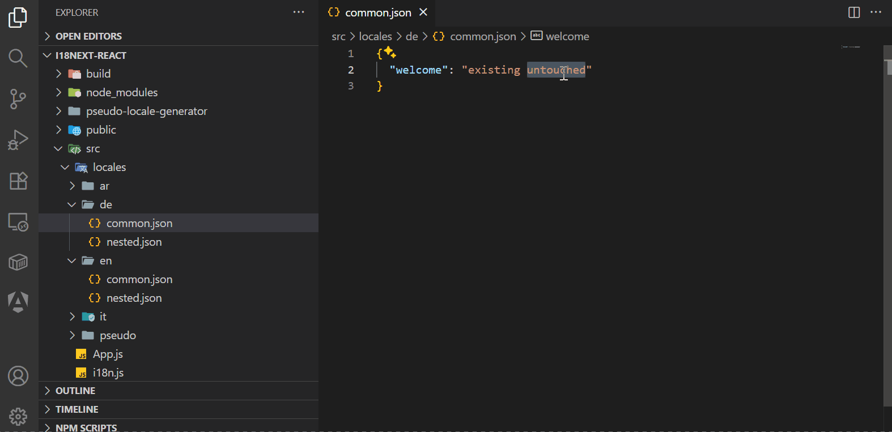
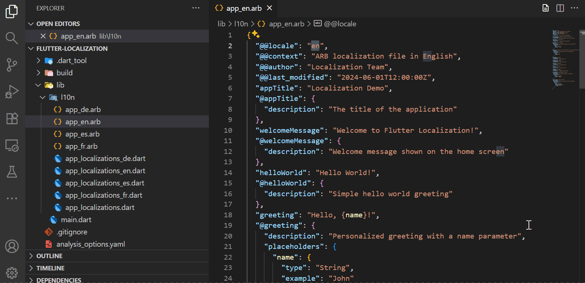

# Translate i18n by l10n.dev

AI-powered localization in VS Code. [Translate i18n](https://l10n.dev/ws/translate-i18n-files) localization files in multiple formats directly in your editor using l10n.dev's intelligent translation service.



## Features

### 🌍 Translate

- **165 languages** — context-aware AI translation, one right-click away in the Explorer or editor.
- **Every major format** — JSON/JSONC, ARB (Flutter), XML/PLIST/RESX/STRINGS (Android, iOS, .NET), YAML (Ruby, Node.js), PO/POT (Gettext, WordPress), XLIFF (Angular, CAT tools), Java `.properties`, CSV/TSV, Markdown, plain text.
- **All languages at once** — send a file to every language your project already has, in a single command.
- **Only what changed** — when a target file exists, translate just the new strings and update it in place, replace it, or save a numbered copy.

### 🛠️ Built for i18n, not generic translation

- **Nothing breaks** — placeholders, HTML tags and formatting are preserved, while dates and numbers adapt to the target locale. [Why this matters](https://medium.com/@AntonAntonov88/i18n-vs-l10n-why-developers-should-care-and-how-ai-can-help-fec7a7580d17)
- **Nothing over-translated** — proper names, URLs and technical terms are left alone.
- **Types survive** — numbers stay numbers, booleans stay booleans, `null` stays `null`. Only string content is translated.
- **Correct plurals** — generates every plural form a language actually needs (Russian, Arabic, Polish…), even when your source has only `_one` and `_other`. Ideal for i18next.
- **Large files stay intact** — content is split into linked chunks that carry context across them, and translations are retried if a placeholder goes missing. Pasting a big file into a chat model instead tends to silently drop, merge or shorten entries.
- **Source text as keys** — works with projects that use the source string itself as the key.

### 🎛️ Control the output

- **[Glossary](#translation-glossary)** — pin your terminology so the AI uses your exact wording, not a valid-but-wrong synonym.
- **[Linguistic instructions](#linguistic-instructions)** — steer overall tone and style: "use formal tone", "don't translate product names".
- **Style switches** — contractions on or off, and shortening when a translation runs longer than the source.

### ⚡ Fits your workflow

- **Knows your layout** — detects target languages from folder-based (`locales/en/`), file-based (`en.json`) and embedded-code (`emails.en.json`, `messages_en_US.properties`) structures and writes files where they belong.
- **[Built-in MCP server](#for-ai-agents-mcp-server)** — turns your coding agent into a localization specialist. Ships with the extension and reuses the API Key you already set.
- **Secure by default** — your API Key lives in VS Code's encrypted secrets storage, never in a config file.
- **Free to start** — 10,000 characters every month, no subscription.

## Getting Started

### 1. Get Your API Key
1. Visit [l10n.dev/ws/keys](https://l10n.dev/ws/keys)
2. Sign up for a free account
3. Generate your API Key

### 2. Configure the Extension
1. Open VS Code Command Palette (`Ctrl+Shift+P` / `Cmd+Shift+P`)
2. Run `l10n.dev: Set API Key`
3. Paste your API Key when prompted
### 3. Translate Your Files
1. Right-click on any supported localization file (JSON, JSONC, ARB, XML, YAML, PO, XLIFF, `.properties`, CSV, TSV, TXT, and more) in the Explorer or Editor
2. Select `Translate to...`
3. Choose your target language (or select **"Translate to All Languages"** for batch translation)
4. If target file(s) exist, choose to update existing files or create new ones
5. Wait for translation to complete
6. Find your translated files in the appropriate language folders

## Supported Project Structures

The extension automatically detects target languages from common i18n project structures and saves translated files accordingly:

### Folder-based Structure
```
locales/
├── en/
│   ├── common.json
│   └── auth.json
├── es/
├── fr/
└── de/
```

**How it works:**
- **Detection**: Language code is identified from the folder name (e.g., `en/`, `es/`, `fr/`)
- **File Saving**: Creates the target language folder if it doesn't exist and saves the file with the same name as the source file
- **Example**: Translating `locales/en/common.json` to Spanish → `locales/es/common.json`

### File-based Structure
```
i18n/
├── en.json
├── en-US.json
├── es.json
├── fr.json
├── de.json
└── zh-Hans-CN.json
```
**How it works:**
- **Detection**: Language code is identified from the filename (e.g., `en.json`, `es.json`, `fr.json`)
- **File Saving**: Saves the translated file using the target language code as the filename in the same folder
- **Example**: Translating `i18n/en.json` to Spanish → `i18n/es.json`

### Language Code Inside the File Name
```
locales/
├── emails.en.json
├── emails.es.json
├── emails.fr.json
├── common.en-US.json
└── messages_en_US.properties
```
The language code doesn't have to be the whole file name — it can sit next to other parts of it, before or after, separated by `.`, `-` or `_`: `emails.en.json`, `emails-en.json`, `en-US.common.json`, `common.en-Latn-US.yml`, `messages_en_US.properties`, `app_en_US.arb`.

**How it works:**
- **Detection**: The language code is located inside the file name, and files sharing the same naming pattern become the detected target languages — `emails.en.json` next to `emails.es.json` and `emails.fr.json` detects `es` and `fr`, while `common.de.json` is ignored
- **File Saving**: The code is replaced, not appended, and the separator style of the source name is preserved — `emails.en.json` → French becomes `emails.fr.json`, and `messages_en_US.properties` → Russian becomes `messages_ru_RU.properties`
- **Example**: Translating `locales/emails.en.json` to Spanish → `locales/emails.es.json`

> Every subtag is validated against ISO language, script and region codes, so ordinary file names such as `strings.min.json` or `config.dev.json` are never mistaken for a language.

### Unknown Structure Fallback
For projects that don't match the above patterns, the extension falls back to saving files with the format: `{originalname}.{languagecode}.{ext}` in the same directory as the source file.


### ARB File Support (Flutter Localization)



The extension fully supports ARB (Application Resource Bundle) files used in Flutter applications:

- **Automatic Metadata Updates**: The API automatically updates `@@locale` to the target language code and `@@last_modified` to the current UTC timestamp
- **Metadata Translation Control**: By default, metadata entries (like `@key`) are NOT translated and remain unchanged. Enable the `translateMetadata` setting if you want to translate these metadata (e.g. description, example, context for translators) along with UI strings
- **Custom Prefixes**: Supports custom file naming patterns (e.g., `app_en_US.arb`, `my_app_fr.arb`)
- **Underscore Format**: ARB files use underscores instead of hyphens (e.g., `en_US` instead of `en-US`)
- **Perfect for Flutter**: Seamlessly integrates with Flutter's localization workflow

## Configuration Options

Configure translation behavior in VS Code settings (`Ctrl+,` and search for "l10n-translate-i18n"):

- **Use Contractions**: Makes translations less formal (default: true)
- **Use Shortening**: Uses shortened forms if translation is longer than source (default: false)
- **Generate Glossary**: Generate and save a glossary from source and translated content for this language pair. See [Translation Glossary](#translation-glossary)
- **Generate Plural Forms**: Generates additional plural form strings (e.g., for i18next) with plural suffixes. Do not enable for strict source-to-target mapping (default: false)
- **Translate Metadata**: Translate metadata along with UI strings. For example, in Flutter ARB files, metadata entries like `@key` contain descriptions that can also be translated. Enable to translate metadata (default: false)
- **Enable MCP Server**: Offer the built-in l10n.dev MCP server to Chat, using the API Key stored by this extension (default: true). See [For AI Agents (MCP Server)](#for-ai-agents-mcp-server)

## Commands

- `Translate i18n: Set API Key` - Securely configure API Key
- `Translate i18n: Clear API Key` - Clear API Key in VS Code secrets storage
- `Translate i18n: Configure Translation Options` - Open extension settings
- `Translate i18n: Translate to...` - Translate any supported localization file (JSON, ARB, XML, YAML, PO, XLIFF, `.properties`, CSV, TSV, TXT, and more)

## Translation Glossary

A translation glossary maps specific source-language terms to approved target-language equivalents, ensuring the AI uses your exact terminology instead of valid-but-unintended synonyms. Glossaries are especially valuable for brand names, legal terms, clinical vocabulary, and product-specific concepts.

### AI Glossary Generation

When **Generate Glossary** is enabled (config) it automatically builds a glossary from the source and translated target content, then save it as the active glossary for this source/target language pair. Once saved, the glossary is applied automatically on all future translations for the same language pair.

> **Note:** When **Generate Glossary** is enabled, your character quota is debited for the full source content upfront — even when you choose translating only new strings. When disabled (default), a temporary internal glossary is generated automatically at no extra cost only for large files that exceed the AI chunk size.

Manage your saved glossaries at [l10n.dev/ws/translation-glossary](https://l10n.dev/ws/translation-glossary).

## Linguistic Instructions

Linguistic Instructions let you guide AI, for example:
- 📝 "Use formal tone"
- 📝 "Do not translate product names"
- 📝 "Use active voice"

Unlike glossaries that control specific terms, Linguistic Instructions control the overall style, tone, and translation behavior.
Combined with AI Glossaries, they give much more control over localization quality and brand consistency.

Manage your saved linguistic Instructions at [l10n.dev/ws/linguistic-instructions](https://l10n.dev/ws/linguistic-instructions).

## Related Project: ai-l10n npm Package

Looking for a programmatic solution? Check out the [**ai-l10n**](https://www.npmjs.com/package/ai-l10n) npm package! This Node.js package provides the same powerful AI translation capabilities directly in your JavaScript/TypeScript projects.

**Why use ai-l10n?**

1. **CI/CD Integration** - Automate translations in your build pipeline or deployment workflows
2. **Programmatic Control** - Full API access with TypeScript support for custom translation logic and batch processing
3. **CLI Support** - Command-line interface for quick translations without opening VS Code
4. **Framework Agnostic** - Use with any Node.js project: React, Vue, Angular, Next.js, Express, or standalone scripts
5. **Advanced Features** - Access to l10n.dev API

Perfect for developers who want to integrate AI-powered localization into their automated workflows, build tools, or server-side applications.

## For AI Agents (MCP Server)

Turn your coding agent into a localization specialist. The agent translates i18n files without dumping their contents into its context — the files are translated server-side, so you save tokens and the agent stays focused on coding.

### In VS Code — already built in

The [ai-l10n MCP server](https://www.npmjs.com/package/ai-l10n-mcp) ships with this extension. There is nothing to install and no `mcp.json` to edit: open Chat in agent mode and the **l10n.dev** server is already available. Your API Key is passed to the server from VS Code's secrets manager when it starts, so it never ends up in a config file.

Available tools:

- **Translation**: `l10n_translate_file`, `l10n_detect_project_structure`
- **Glossaries**: list, get, create, update, delete glossaries and entries
- **Linguistic instructions**: list, create, update, delete
- **Account**: `l10n_get_balance`, `l10n_get_api_key_status`

Set the API Key once with `l10n.dev: Set API Key` and the server picks it up. If you already configured a key outside VS Code (via the `ai-l10n` CLI or another agent), that one keeps working too. To turn the built-in server off — for example if you prefer your own `mcp.json` entry — disable **Enable MCP Server** in settings.

### In other agents

The same server works with Cursor, Claude, Codex, and Windsurf via `npx -y ai-l10n-mcp`. See the [AI Localization Agent Setup Guide](https://l10n.dev/help/ai-localization-agent) for per-agent configuration.

## Language Support

l10n.dev supports 165+ languages with varying proficiency levels:
- **Strong (12 languages)**: English, Spanish, French, German, Chinese, Russian, etc.
- **High (53 languages)**: Most European and Asian languages
- **Moderate (100+ languages)**: Wide range of world languages

## Pricing

- **Free Characters**: 10,000 characters for free monthly.
- **Pay-as-you-go**: Affordable character-based pricing. Visit [l10n.dev/#pricing](https://l10n.dev/#pricing) for current pricing.
- **No subscription required**

## Troubleshooting

### Common Issues

**"API Key not configured"**
- Run `l10n.dev: Set API Key` command
- Ensure you've copied the key correctly from [l10n.dev/ws/keys](https://l10n.dev/ws/keys)

**"Insufficient balance"**
- Check your account balance at [l10n.dev](https://l10n.dev)
- Purchase more characters if needed

**"No languages detected"**
- The extension will prompt you to enter a language code manually
- Use BCP-47 format (e.g., "es", "fr", "zh-CN", "en-US")
- Detection covers language codes in folder names, whole file names and inside file names (see [Supported Project Structures](#supported-project-structures)); a name that doesn't carry a valid code anywhere falls back to manual entry

**"Invalid JSON file"**
- Ensure your JSON file is valid
- Check for syntax errors using VS Code's built-in JSON validation

**MCP server shows an error in Chat**
- Run `MCP: List Servers` from the Command Palette, select **l10n.dev**, then **Show Output** to see the server log
- If the tools report a missing API Key, run `l10n.dev: Set API Key` and restart the server — or ask your agent to run `l10n_get_api_key_status`
- Seeing the l10n tools twice? You likely also have `ai-l10n-mcp` in your own `mcp.json` — turn off the **Enable MCP Server** setting or remove your manual entry

### Important: Working with Arrays in JSON

⚠️ **When using "Translate Only New Strings"**: If your JSON contains arrays (not just objects), make sure the array indexes in your target file match those in the source file. This ensures translations remain consistent. **When adding new strings, always append them to the end of the array.**

**Example:**
```json
// ✅ CORRECT: New items added at the end
// source.json
["Apple", "Banana", "Orange"]

// target.json (existing)
["Manzana", "Plátano"]

// After translation (new item appended)
["Manzana", "Plátano", "Naranja"]

// ❌ INCORRECT: Items inserted in the middle
// This will cause misalignment!
["Apple", "Cherry", "Banana", "Orange"]
```

For object-based JSON structures (recommended for i18n), this is not a concern as translations are matched by key names.

## Support

- **API Documentation**: [l10n.dev/api/doc](https://l10n.dev/api/doc)
- **Issues**: Report bugs on github

## Privacy & Security

- API Keys are stored securely using VS Code's encrypted secrets storage
- No source code or translations are stored on our servers beyond the processing time
- All communication with l10n.dev API is encrypted (HTTPS)

---

Made with ❤️ for developers who care about internationalization (i18n) and localization (l10n)

---
> **Tip:** For translating a large number of files, use the [I18N File Translation UI](https://l10n.dev/ws/translate-i18n-files) on l10n.dev. The VS Code extension translates files in real time via the [Translate JSON API](https://l10n.dev/api/doc/#tag/json-translation) and does not store your JSON or translations on our servers. For very large files, translation may take several minutes and delivery cannot be guaranteed in all cases.
>
> On the l10n.dev platform, you can securely create translation jobs for batch processing, set custom terminology, monitor progress in real time, and download your files when complete. You have full control: files can be deleted at any time. For automation and CI/CD workflows, our API lets you integrate localization seamlessly into your pipelines.
>
> l10n.dev is built by developers for developers, with privacy, reliability, and quality as top priorities.
